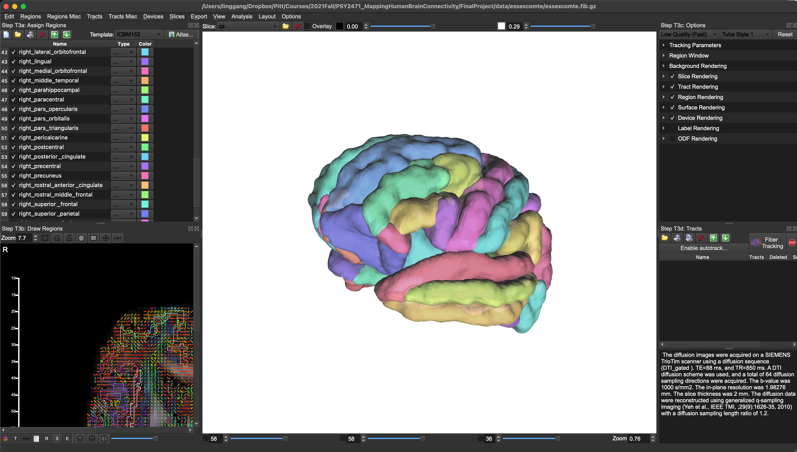

# Week 1 Guidance

Linggang Luo

*January 2022*

Some materials will be shared via our [google drive folder](https://drive.google.com/drive/folders/12XGKtBVUb7i-uW_LSkMERFRhP7S95OrQ?usp=sharing) for confidentiality reasons.

## Before practicum on Friday, please complete following:

### Anatomy

- Read through [Intro to Neuroanatomy slides](https://drive.google.com/file/d/1HPWgLRGzq_l_V7UDE8PC2hVZSaLnawOr/view?usp=sharing) along with Nieuwenhuys 2008 chapters [3](https://drive.google.com/file/d/1r-MC1X7mnUOC2H4Or91BR6y2AQlZs-Dt/view?usp=sharing) and [5](https://drive.google.com/file/d/1-36-KH6Ejxe8s4m9isibjJ2HAGSkEeK2/view?usp=sharing).

- Other open resourses like [UBC Neuroanatomy Season 1](https://www.youtube.com/watch?v=xB7rXw_3gVY&t=104s) and [Brain Anatomy for Health Professionals Series](https://www.youtube.com/watch?v=_aCCsRCw78g&list=PLp9HSlEm97VXyQ32Uwjfz3dpmQ8nl63zJ&index=1&t=539s) would help if you are a visual learner and more comfortable with video tutorials.

- Brain anatomical region student should become familiar with (listed as different systems):
    - Fissures: longitudinal fissure and Sylvian fissure
    - Sulci: Lateral sulcus, precentral sulcus, central sulcus, and postcentral sulcus
    - Gyri: precentral gyrus and postcentral gyrus
    - Neocortex: frontal, parietal, temporal, occipital and insular
    - Forebrain: Thalamus, hypothalamus
    - Midbrain: substantia nigra, cerebral peduncles
    - Basal ganglia: caudate nucleus, globus pallidus, putamen and substantia nigra
    - Limbic area: Hypothalamic nuclei, amygdala, hippocampus, thalamus, corpus callosum and cingulate gyrus
    - Cerebellum  
    - FreeSurferDKT atlas

### DSI-Studio

- Read through Dr. Yeh's [review paper](Materials/paper/review.pdf) on diffusion MRI, which also can be found under the shared folder. Pay special attention to part 3 (tractography methods), 5.2 (model-free methods), part 6 (fiber tracking methods) and part 7 (DTI tractography in brain tumors).

- Download [DSI-Studio](http://dsi-studio.labsolver.org/). Skim the document and play with the software. Data and tutorials can be found on [DSI-Studio website](http://dsi-studio.labsolver.org/).

- Learn [ROI-based fiber tracking](http://dsi-studio.labsolver.org/doc/gui_t3_roi_tracking.html). Watch the tutorial video at the end of the webpage.

- Download [HCP1065.1mm.fib.gz](https://drive.google.com/file/d/16UDflRtCtJ2IAmrxrMJqq69GArU_su8H/view?usp=sharing) from google drive shared folder. Load the fib file on DSI-Studio and then open FreeSurferDKT atlas from the atlas menu in order to learn different brain region. Check the tutorial metioned above if needed. The interface should look like this:

## During practicum on Friday:

- Dr. Yeh's Q&A.

- Quiz on brain anatomical regions. Student should be able to load fib file provided on DSI-Studio, which neuroanatomy will be quized upon. Be sure wherever the region resides, student is capable of visulize it using different techniques (e.g. adjust transparency) in order to show the quized anatomical region.

- Download [homework 1](https://drive.google.com/file/d/1S12jVb7iCe_gQRO_BGZ-ig9cLtTOuvar/view?usp=sharing) from shared folder - homework. 

