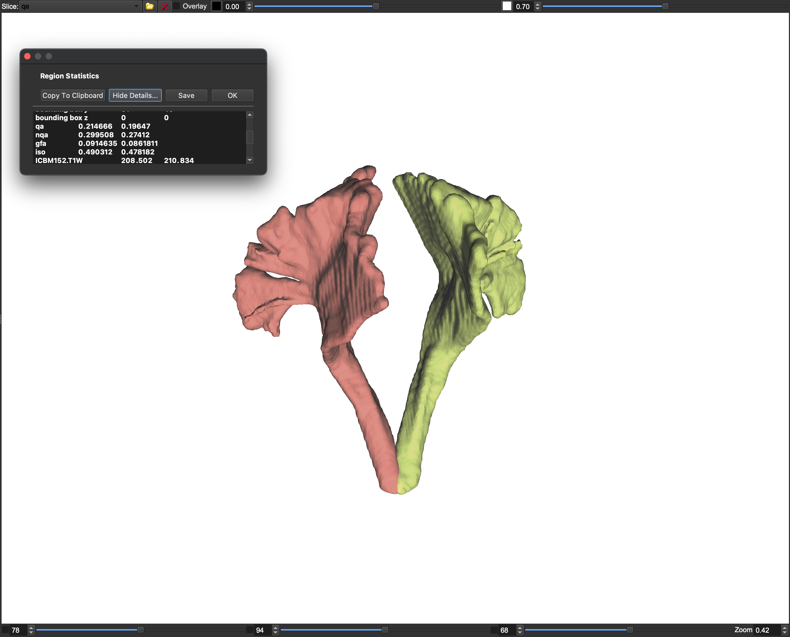
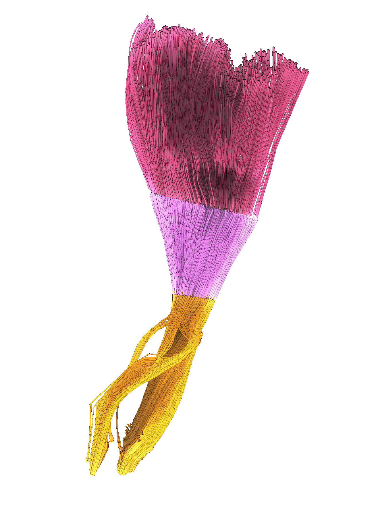
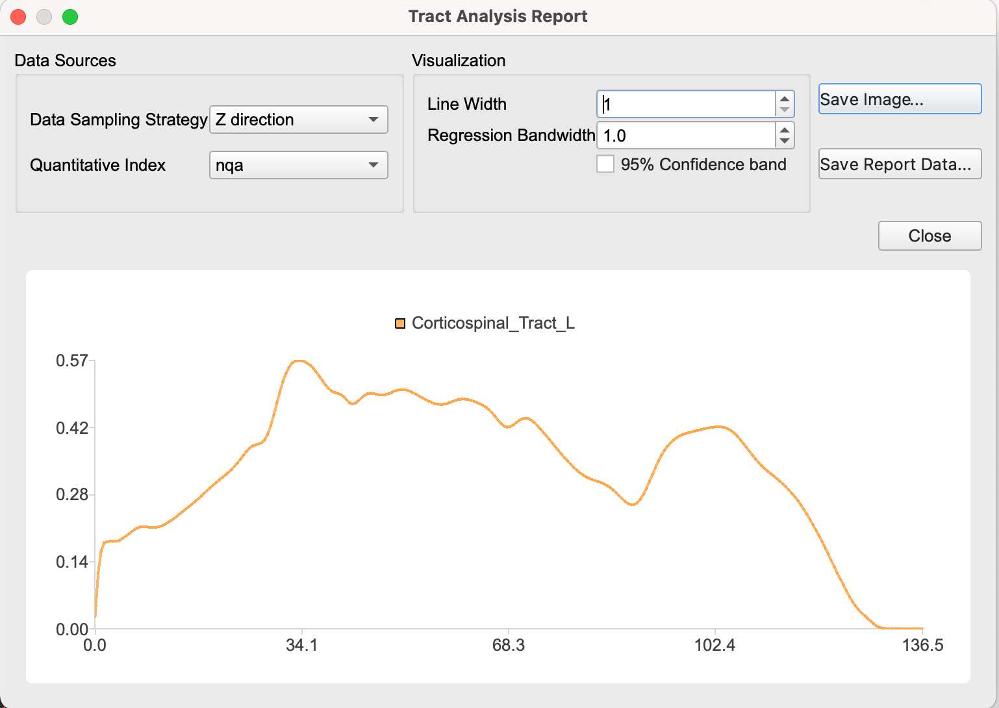

# Week 4 Region-Based & Tract-Based Analysis (Tractometry) 

Linggang Luo

*January 2022*

Some materials will be shared via our [google drive folder](https://drive.google.com/drive/folders/12XGKtBVUb7i-uW_LSkMERFRhP7S95OrQ?usp=sharing) for confidentiality reasons.

---

## Before practicum on Friday, please complete following:

### Review Paper

- [Abhinav, Kumar, et al. "Advanced diffusion MRI fiber tracking in neurosurgical and neurodegenerative disorders and neuroanatomical studies: a review." Biochimica et Biophysica Acta (BBA)-Molecular Basis of Disease 1842.11 (2014): 2286-2297.](Materials/paper/review2.pdf) SECTION 3.4 analytical approaches.

 

## During practicum on Friday:

- Dr. Yeh's Q&A.

#### Region-based analysis 

- [Documentation](https://dsi-studio.labsolver.org/doc/gui_t3_roi_tracking.html).

- Demonstrate using corticospinal tract (CST) ROI to get diffusion metrics.

#### Tract-based analysis 

- [Documentation](https://dsi-studio.labsolver.org/doc/gui_t3_roi_tracking.html).

- Demonstrate CST fiber tracking to get diffusion metrics at CST.

- Use tract cutting (with selection & separate deleted tract) to segment CST into segments above internal capsule (IC), IC, and below IC sections.

#### Tract profile

- [Documentation](https://dsi-studio.labsolver.org/doc/gui_t3_roi_tracking.html).

- Plot along tract metrics at z-direction or fiber direction.

---

### Practicum task: Mapping unknown pathways using ROI-based fiber tracking

1. Download subject FIB files at (pending).

2. Use region-based analysis to get metrics (nqa, fa) from patients and controls and compare.

3. Use tract-based analysis to get metrics (nqa, fa) from patients and controls and compare.
 
3. Segment CST into segmentation to get metrics (nqa, fa) and compare them between patients and controls.

4. Get tract profile of metrics (nqa, fa) and average within patients and controls groups, respectively. Comparison.

